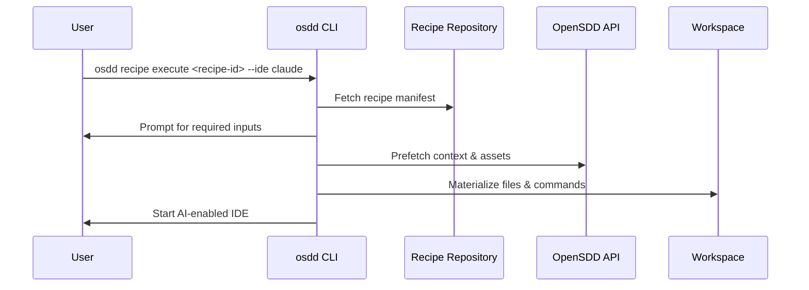

# OpenSDD CLI (`osdd`)

The OpenSDD CLI lets you discover and run OpenSDD recipes from your terminal or IDE. It fetches recipes, gathers required inputs, prepares workspaces, and executes automation steps end-to-end.

---

## At a Glance

- Install prebuilt binaries for macOS, Linux, or Windows (Homebrew available on macOS/Linux).
- Run published recipes by ID (for example the catalog in `opensdd/recipes`).
- Execute local YAML/JSON recipes while developing new automations.
- Enjoy a colorful ASCII logo with `osdd version` and graceful fallbacks for CI output.



---

## Installation

### Option 1: Homebrew (macOS & Linux)

```bash
brew install opensdd/tap/osdd

# verify
osdd version
```

### Option 2: Download a Release Binary

1. Visit the [releases page](https://github.com/opensdd/osdd-cli/releases).
2. Download the artifact for your platform:
   - `osdd-macos-x64` (macOS)
   - `osdd-linux-x64` (Linux)
   - `osdd-windows-x64.exe` (Windows)
3. Place the binary on your `PATH` and make it executable (macOS/Linux):

```bash
chmod +x osdd
sudo mv osdd /usr/local/bin/
osdd version
```

Windows users can run `osdd.exe` directly or move it to a directory listed in `%PATH%`.

### Option 3: Build from Source (advanced)

Requires Go 1.25.1 or newer.

```bash
git clone https://github.com/opensdd/osdd-cli.git
cd osdd-cli
make build        # or: make build-dev for a dev build
./osdd version
```

---

## Quick Start

1. **Pick a recipe**
   Browse [`opensdd/recipes`](https://github.com/opensdd/recipes/global) to find an automation. Recipes are identified by the name of the folder in this repository, for example:
   `docs_update`

2. **Run the recipe**
   ```bash
   osdd recipe execute docs_update --ide claude
   ```
   - `--ide` names the IDE integration (`claude`, `codex`).
   - The CLI fetches the recipe, and prompts for any declared user inputs.

3. **Follow the prompts**
   Provide requested information (multi-line text, options, and so on). When you finish, the CLI materializes files, configures workspaces, and executes the recipe steps.

4. **Follow the execution in the IDE**
   The CLI will start the IDE requested and will optionally prompt it to start the work (depends on the recipe). You may need to pay attention to what the IDE is doing, since it may request permissions or confirmations.

---

## Command Reference

```bash
osdd version                            # display current logo
osdd recipe execute <ID>                # run a recipe by ID
osdd recipe execute <ID> --ide <name>   # required IDE identifier
```

---

## Support & Related Projects

- Open issues or feature requests in [opensdd/osdd-cli](https://github.com/opensdd/osdd-cli/issues).
- Explore the broader OpenSDD ecosystem:
  - [opensdd/osdd-api](https://github.com/opensdd/osdd-api) – Protobuf definitions & clients referenced by the CLI.
  - [opensdd/osdd-core](https://github.com/opensdd/osdd-core) – Core runtime used to materialize recipes.
  - [opensdd/recipes](https://github.com/opensdd/recipes) – Official recipe catalog (see its README for authoring guidance).

Licensed under the terms of the [LICENSE](LICENSE) file.
